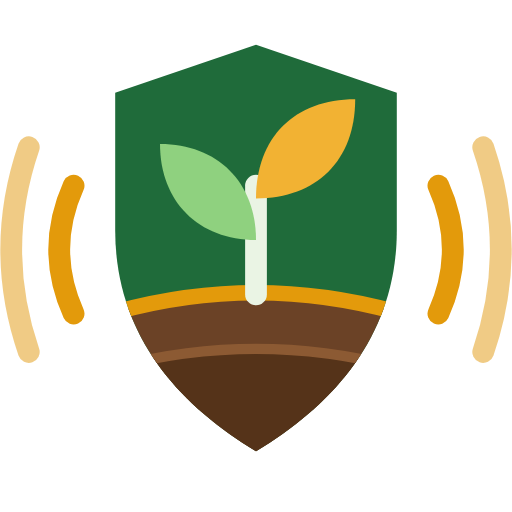

<p align="center">
  
</p>

<h1 align="center">KhetiSathi · खेती साथी</h1>

<p align="center"><b>Keep monkeys out of the field and grow more.</b><br>
A free web app for Nepali farmers: a camera monkey guard with sound and light deterrents, a crop calendar and a fertilizer calculator.</p>

---

## What it does

### 🐒 Monkey Guard (बाँदर धपाउने)
- **Watches the field** through a phone or laptop camera and detects movement.
- **AI monkey check** (optional, TensorFlow.js MobileNet) scares only when it sees a monkey or langur, not a person walking past. It needs internet the first time; without it the app uses movement detection.
- **Scares with a random mix** of dog barks, firecrackers, a leopard call, thali banging, a siren, a sharp whistle, or your own recording. It never plays the same sound twice in a row, so monkeys take longer to get used to it.
- **Flashes the screen and the phone torch** (Android, live camera).
- **Guard hours, cooldown and ignore areas** (tap trees or roads on the picture to ignore them).
- **Patrol mode** scares at random times, even with no camera.
- **Visit log** with a photo, time and sounds used, plus a chart of which hours monkeys come.
- **Demo field** shows how it works without a camera.

### 🌾 Crop Growth (बाली र मल)
- Sowing and harvest **calendar in Nepali months** for the Terai and the mid-hills.
- **Monkey risk** for each crop, and crops monkeys avoid (ginger, turmeric, chilli, garlic, colocasia) to plant at the forest edge.
- **Fertilizer calculator**: enter land in ropani, aana, kattha, dhur, bigha or hectare and get urea, DAP, potash (MOP) and compost in kg, with when to apply each.

### 🔧 Field Setup (खेतमा जडान)
- How to mount an old Android phone on a pole with a loudspeaker and solar power.
- An **Arduino sensor post** (PIR sensor + DFPlayer Mini + light and siren) for fields without a phone. Code: [`arduino/khetisathi_post/khetisathi_post.ino`](arduino/khetisathi_post/khetisathi_post.ino)

## How to use it

**On a laptop:** download `index.html` and open it in Chrome. Allow camera access when asked.

**On a phone in the field:** the camera only works from a secure `https` link. Turn on GitHub Pages for this repository (Settings → Pages → Deploy from branch → `main` / root). The app is then at:

```
https://siddhu-710.github.io/Siddhu-710/
```

Open that link in Chrome on the phone and choose **Add to Home screen**. Then pick **Live camera**, mark ignore areas, connect a Bluetooth speaker, set guard hours and press **Arm guard**. The screen stays on while the guard is armed.

## Tips that make it work better
- Keep at least four sounds on and move the pole every week or two. Monkeys learn fast.
- Now and then, follow an alarm by walking out with a dog. Monkeys learn the sound means a person is coming.
- Clear bushes 10–20 m from the field edge and never leave food waste nearby.
- Guard together with neighbours. A whole slope guarded together works far better than one field.
- **Scare, never hurt.** Monkeys and langurs are respected and can bite when cornered.

Fertilizer doses are typical recommendations for improved varieties. A soil test at your nearest Agriculture Knowledge Centre (कृषि ज्ञान केन्द्र) gives the exact amount for your field.

## Files

| Path | What it is |
|---|---|
| `index.html` | The whole app in one file (no install, works offline after first load) |
| `assets/` | Logo as SVG and PNG |
| `arduino/khetisathi_post/` | Arduino sketch for the sensor post |

Your visit log and settings are saved only on the device you use.
