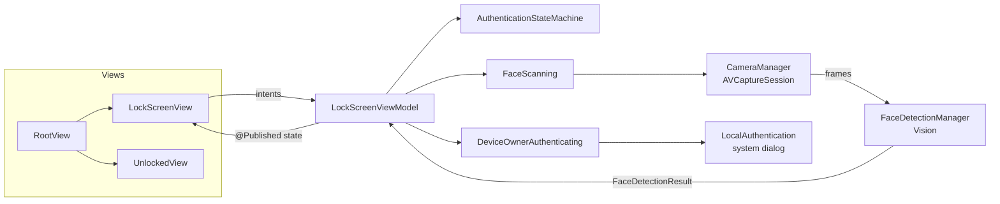
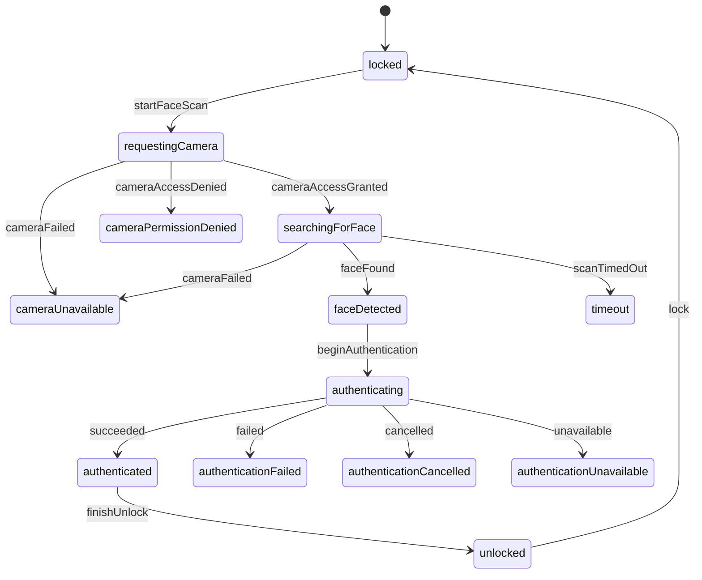

# Face ID Lock for macOS

A polished, **Face ID–inspired lock-screen demo** for Macs with Apple silicon, built entirely with native frameworks: SwiftUI, AVFoundation, Vision and LocalAuthentication.

The app opens full screen with a large clock, your name and a monogram avatar. It uses the camera to notice that someone is in front of the Mac, animates a scan, and then asks **macOS itself** to verify the device owner (Touch ID, Apple Watch or the account password) before playing an unlock animation.


> [!IMPORTANT]
> **This is a demo, not a security product.** It does not replace, modify or sit in front of the macOS login window, and it does not lock your Mac. Closing the app, switching Spaces or pressing ⌘Tab gets you out of it. To lock your Mac for real, press **⌃⌘Q**.
>
> The camera step is **face presence detection, not face recognition**. It only answers "is there a face in front of the camera?". The identity check is done by Apple's LocalAuthentication framework in a system dialog. Macs do not have Face ID hardware. See [macOS limitations](#macos-limitations).

---

## Contents

- [Features](#features)
- [Screenshots](#screenshots)
- [Requirements](#requirements)
- [Getting started](#getting-started)
- [Trying the demo](#trying-the-demo)
- [Architecture](#architecture)
- [Permissions](#permissions)
- [Security and privacy](#security-and-privacy)
- [macOS limitations](#macos-limitations)
- [Accessibility](#accessibility)
- [Testing](#testing)
- [Troubleshooting](#troubleshooting)
- [Moving it to its own repository](#moving-it-to-its-own-repository)
- [Contributing](#contributing)
- [License](#license)

---

## Features

- **Full-screen lock screen.** Large clock and date, avatar and name, and a softly animated, frosted background that follows light and dark mode.
- **Face ID-style scan animation.** Viewfinder brackets lock on, a scan line sweeps, a tick ring spins while authenticating, and a checkmark draws itself on success. The glyph is original artwork, not Apple's Face ID symbol.
- **Camera-based face detection.** `AVCaptureSession` feeds low-resolution frames to Vision's `VNDetectFaceRectanglesRequest`. You get live guidance such as *"Move a little closer"*.
- **Real authentication.** Uses `LAContext` with `.deviceOwnerAuthentication`, so macOS picks Touch ID, Apple Watch or your password.
- **Keyboard and password fallback.** Press Return at any time to skip the camera and authenticate with Touch ID or your password.
- **Explicit state machine** covering every success and failure path, with unit tests.
- **Privacy by construction.** No frames or face data are stored, the camera turns off as soon as it has done its job, and the sandbox has no network access.
- **Accessibility.** VoiceOver labels and announcements, Reduce Motion, Reduce Transparency, Increase Contrast, an in-app text size setting and full keyboard control.
- **Responsive layout.** Scales from a small window up to a 13" or 15" MacBook Air and large external displays.

## Screenshots

Screenshots aren't committed yet. After your first run, capture a few with **⇧⌘5** (or `screencapture -w docs/screenshots/<name>.png`) and add them here:

| Lock screen (dark) | Scanning | Unlocked |
| --- | --- | --- |
| `docs/screenshots/lock-dark.png` | `docs/screenshots/scanning.png` | `docs/screenshots/unlocked.png` |

<!--
Replace the table above once the images exist:

| Lock screen (dark) | Scanning | Unlocked |
| --- | --- | --- |
|  |  |  |
-->

## Requirements

| | Minimum | Notes |
| --- | --- | --- |
| **Run** | macOS 14 Sonoma | Tested target: MacBook Air with Apple silicon |
| **Build** | Xcode 16.3 (Swift 6.1 toolchain) | Xcode 26 or later is recommended. Xcode 16.3 needs macOS 15.2+ |
| **Camera** | Built-in FaceTime HD camera, or any camera macOS recognizes | With the lid closed (clamshell), connect an external or Continuity camera |
| **Authentication** | A login password on your Mac account | Touch ID and Apple Watch are used automatically when available |

The project compiles in the Swift 5 language mode. Xcode 16.3 or later is required because a few types are marked `nonisolated` at the type level (SE-0449). That keeps the camera code off the main actor even if you paste the files into a new Xcode 26 project that defaults to main-actor isolation.

## Getting started

### Option A: open the included project (recommended)

The project lives in the `macos-faceid-lockscreen/` folder of the [Siddhu-710](https://github.com/Siddhu-710/Siddhu-710) repository:

```bash
git clone https://github.com/Siddhu-710/Siddhu-710.git
cd Siddhu-710/macos-faceid-lockscreen
open FaceIDLock.xcodeproj
```

1. Select the **FaceIDLock** scheme and **My Mac** as the destination.
2. Press **⌘R**.

The project signs with **Sign to Run Locally** (ad-hoc) by default, so no Apple Developer account is needed. If you pick your own team in *Target ▸ Signing & Capabilities*, macOS will also remember the camera permission across rebuilds (see [Troubleshooting](#troubleshooting)).

### Option B: create the project yourself and copy the files in

1. In Xcode choose **File ▸ New ▸ Project… ▸ macOS ▸ App**.
   - Product Name: `FaceIDLock`
   - Interface: **SwiftUI**, Language: **Swift**, Testing System: **XCTest**, Storage: **None**
2. Delete the template's `ContentView.swift` and `FaceIDLockApp.swift`. `App.swift` replaces them.
3. Copy everything inside this repo's `FaceIDLock/` folder into your project's `FaceIDLock/` folder, **except `FaceIDLock.entitlements`**, and replace `Assets.xcassets`. Xcode 16+ picks up new files automatically.
4. Copy this repo's `FaceIDLockTests/*.swift` into your test folder and delete the template test file.
5. **Target ▸ Signing & Capabilities ▸ App Sandbox:** enable **Camera** (in Xcode 26 it's under *Resource Access*).
6. **Target ▸ Info:** add **Privacy - Camera Usage Description** (`NSCameraUsageDescription`), for example *"Face ID Lock uses the camera only to detect whether a face is in front of your Mac."*
7. **Target ▸ Build Settings:**
   - *macOS Deployment Target* → **14.0**
   - *Default Actor Isolation* (Xcode 26+) → **nonisolated**, to match the included project
8. Build and run with **⌘R**.

## Trying the demo

1. **Launch.** The window goes full screen and shows *"Starting camera…"*.
2. **Grant camera access** when macOS asks. This happens only once per signing identity.
3. **Look at the screen.** The status changes from *"Looking for your face…"* (or *"Move a little closer"*) to **Face detected**. The brackets lock on, and the camera switches off.
4. **Authenticate.** macOS shows its own dialog: *"Face ID Lock is trying to unlock the Face ID Lock demo."* Touch the Touch ID sensor or enter your password.
5. **Unlock.** A checkmark draws in, *"Welcome · Unlocking…"* appears, and the unlocked screen follows.
6. **Lock again** with **⌘L** or the *Lock Screen* button. The demo also locks automatically when your Mac or display goes to sleep.

Things worth trying:

- Cover the camera and wait for the **timeout** (10 seconds by default).
- Press **Esc** while scanning to cancel, or **Return** to use Touch ID or your password instead.
- Click **Cancel** in the system dialog to see **Authentication cancelled**.
- Deny camera access in System Settings to see the **camera permission** state.
- Turn on **Reduce Motion** or **Increase Contrast** in *System Settings ▸ Accessibility*.

### Keyboard shortcuts

| Keys | Action |
| --- | --- |
| **Return** | Primary action shown on screen (Scan Face, Use Password or Try Again) |
| **Esc** | Cancel the current scan |
| **⌘R** | Scan face |
| **⇧⌘P** | Authenticate with Touch ID or password |
| **⌘L** | Lock |
| **⌘,** | Settings |
| **⌃⌘F** | Leave or enter full screen |
| **⌘Q** | Quit |

### Settings (⌘,)

- **Display name.** Leave it empty to use your macOS account name.
- **Start scanning automatically** when the lock screen appears.
- **Stop looking after** 5, 10, 15 or 30 seconds.
- **Open in full screen**, handy to turn off while developing.
- **Text size:** Standard, Large or Extra Large.

## Architecture

The app uses MVVM with a pure state machine at its core. Views render state, the view model decides, and the services talk to Apple's frameworks.

```text
FaceIDLock/
├── App.swift                        App entry: window, menu commands, Settings scene
├── LockScreenView.swift             Clock, avatar, scan glyph, status, fallback buttons
├── AuthenticationManager.swift      LocalAuthentication wrapper + error mapping
├── CameraManager.swift              AVCaptureSession lifecycle on a private queue
├── FaceDetectionManager.swift       Vision face-rectangle detection per frame
├── FaceScanner.swift                Glues camera → Vision; FaceScanning protocol
├── Models/
│   ├── AuthenticationState.swift    States, events, and the transition table
│   ├── AuthenticationModels.swift   Outcome, availability, biometry kind
│   ├── FaceDetectionResult.swift    Per-frame result + "move closer" guidance
│   ├── LockScreenConfiguration.swift  Timings, thresholds, preference keys
│   └── UserProfile.swift            Display name and initials
├── ViewModels/
│   ├── LockScreenViewModel.swift    Orchestrates the flow; owns all async work
│   └── LockScreenStatus.swift       State → copy, glyph phase and buttons
├── Views/
│   ├── RootView.swift               Lock ↔ unlocked transition, lifecycle events
│   ├── UnlockedView.swift           Post-unlock screen
│   ├── SettingsView.swift           Preferences window
│   └── LockScreenCommands.swift     Menu bar commands and shortcuts
├── Components/                      Scan glyph, clock, avatar, background, buttons…
├── Resources/Credits.rtf            About panel text
└── Assets.xcassets                  App icon (original artwork) and accent colour
```



**Key design decisions**

- **One source of truth for transitions.** `AuthenticationStateMachine.nextState(from:on:)` is a pure function. The view model can only change state by sending an event, and events that make no sense in the current state are ignored.
- **Stale callbacks can't move the UI.** Every scan gets a generation number. Frames, camera errors and timeouts from an abandoned attempt are discarded.
- **Threading.** `CameraManager` confines `AVCaptureSession` to a private serial queue, because `startRunning()` blocks. Vision runs on the capture queue, one frame at a time, throttled to about 10 fps. The view model is `@MainActor`.
- **Protocols at the seams.** `FaceScanning` and `DeviceOwnerAuthenticating` let the tests drive the whole flow without a camera or system dialogs.

### Authentication state machine



In addition to the transitions above:

- **Password fallback.** `beginAuthentication` is also accepted from `locked`, `requestingCamera`, `searchingForFace`, `timeout`, and the camera and authentication failure states.
- **Retry.** `startFaceScan` is accepted from every recoverable failure.
- **Lock.** `lock` is accepted from every state.

| State | What the user sees | Camera |
| --- | --- | --- |
| `locked` | "Locked · Press Return to scan your face" | Off |
| `requestingCamera` | "Starting camera…" (plus the system prompt on first run) | Starting |
| `searchingForFace` | "Looking for your face…" / "Move a little closer" / "Hold still…" | **On** |
| `faceDetected` | "Face detected", brackets lock on | Off |
| `authenticating` | "Authenticating…", macOS dialog | Off |
| `authenticated` | ✓ "Welcome · Unlocking…" | Off |
| `unlocked` | Unlocked screen | Off |
| `cameraPermissionDenied` | Link to System Settings, password fallback | Off |
| `cameraUnavailable` | Reason, Try Again, password fallback | Off |
| `authenticationFailed` | Reason, shake, Try Again | Off |
| `authenticationCancelled` | Try Again, password fallback | Off |
| `authenticationUnavailable` | Reason (for example, no login password set) | Off |
| `timeout` | "No face detected", Try Again | Off |

## Permissions

| Permission | Why | Where it's declared |
| --- | --- | --- |
| **Camera** | Detects whether a face is present | `NSCameraUsageDescription` (build setting `INFOPLIST_KEY_NSCameraUsageDescription`) and the `com.apple.security.device.camera` sandbox entitlement |
| **App Sandbox** | Least privilege | `FaceIDLock/FaceIDLock.entitlements` |

There is no network entitlement, so the sandbox prevents the app from making any network connection.

LocalAuthentication needs no permission or entitlement on macOS. `NSFaceIDUsageDescription` is an iOS-only key and is intentionally absent.

To reset the camera decision and see the prompt again:

```bash
tccutil reset Camera io.github.siddhu710.FaceIDLock
```

## Security and privacy

**What the app does**

- Streams 640×480 camera frames into memory. Each frame is analyzed by Vision for face *rectangles*, then released immediately. Only the bounding box of the largest face is kept, and only until the next frame.
- Stops the camera as soon as a face is found, when a scan times out or is cancelled, when you choose the password fallback, when the app loses focus, and when the Mac sleeps.
- Asks LocalAuthentication to evaluate `.deviceOwnerAuthentication` with a fresh `LAContext` for every attempt. Cancelling (locking or sleeping mid-prompt) calls `invalidate()`, which dismisses the dialog.

**What the app never does**

- Save frames, images, video, facial landmarks, face prints, embeddings or templates, to disk or anywhere else.
- Recognize or compare faces. Any face passes the presence check, and **only macOS decides who you are**.
- See, request or store your password. It is typed into Apple's system dialog, outside this process.
- Touch the login window, Secure Enclave, FileVault, PAM, authorization plugins or any private API.
- Use the network.

**Threat model.** The face scan is a UX flourish, not a security control. Anyone can pass it with any face or a photo. Security comes entirely from LocalAuthentication, and the demo protects nothing beyond its own "unlocked" screen. Don't use this pattern to gate anything sensitive.

To report a security issue, see [SECURITY.md](SECURITY.md).

## macOS limitations

| You might expect | What macOS allows | What this app does instead |
| --- | --- | --- |
| Replace the macOS lock or login screen | Apps can't replace `loginwindow`. Custom login UI needs authorization plugins that run as root, which is a bad idea for a demo | Runs as a normal full-screen app and says so on screen |
| Real Face ID on a Mac | No Mac has Face ID hardware, and there's no public API for third-party biometric matching | Vision detects *presence*; LocalAuthentication performs the real Touch ID or password check |
| Face ID-style inline authentication | The LocalAuthentication dialog is system UI and can't be restyled or embedded (except the Touch ID-only `LAAuthenticationView`) | The app animates around the system dialog |
| Prevent quitting or switching away | Kiosk presentation options exist, but trapping the user is hostile and pointless here | Native full screen that you can always leave with ⌃⌘F, ⌘Tab or ⌘Q |
| Password field on the lock screen | Verifying the account password yourself means handling it in-process | Return opens the system dialog, where macOS handles the password |
| Show your real account picture | Reading it requires directory APIs that aren't available to sandboxed apps | Generated monogram avatar |
| Dynamic Type like iOS | macOS doesn't provide system-wide Dynamic Type to SwiftUI apps | Honors `dynamicTypeSize` when present, plus an in-app Text Size setting |
| Hide the camera light | The hardware indicator can't be (and shouldn't be) suppressed | An on-screen "Camera on" pill as well, since the menu bar is hidden in full screen |

## Accessibility

- **VoiceOver.** The clock and the status read naturally, decorative art is hidden, and every state change is announced.
- **Reduce Motion.** No scan line, spinning ring, shake, drifting background or zoom transitions. Changes cross-fade instead.
- **Reduce Transparency.** Materials are replaced with solid colors.
- **Increase Contrast.** Glyph strokes and button borders get heavier.
- **Text size.** An in-app setting multiplied by any Dynamic Type size in the environment.
- **Keyboard.** Every action is reachable with Return, Esc and menu shortcuts.

## Testing

Run the tests in Xcode with **⌘U**, or from the command line inside `macos-faceid-lockscreen/`:

```bash
xcodebuild test \
  -project FaceIDLock.xcodeproj \
  -scheme FaceIDLock \
  -destination 'platform=macOS'
```

| Suite | What it covers |
| --- | --- |
| `AuthenticationStateMachineTests` | Every allowed transition, and a set of forbidden ones |
| `LockScreenViewModelTests` | End-to-end flows with mocks: success, timeout, permission denied, camera failure, cancel, password fallback, lock, sleep, stale frames |
| `AuthenticationManagerTests` | `LAError` → outcome mapping, biometry mapping |
| `FaceDetectionTests` | Guidance thresholds, and a real Vision run on a blank frame |
| `PresentationTests` | Status copy, buttons, initials, preference loading |

When the app is launched as a test host, it shows a placeholder window and never touches the camera. The camera and the LocalAuthentication dialog need a human, so try them with the steps in [Trying the demo](#trying-the-demo).

GitHub Actions runs the same tests whenever this folder changes (`.github/workflows/faceid-lock-ci.yml` at the repository root).

## Troubleshooting

<details>
<summary><strong>The camera prompt never appears, or it says "Camera access is off"</strong></summary>

Open **System Settings ▸ Privacy & Security ▸ Camera** and enable **Face ID Lock**, or reset the decision with `tccutil reset Camera io.github.siddhu710.FaceIDLock`. If you created the project yourself, check that the Camera sandbox capability and `NSCameraUsageDescription` are set. Without the usage description, macOS terminates the app when it touches the camera.
</details>

<details>
<summary><strong>macOS asks for camera permission after every rebuild</strong></summary>

Ad-hoc signed builds get a new code signature each time, and macOS ties permission to the signature. Select your team in *Target ▸ Signing & Capabilities* (a free Apple ID works) to get a stable identity.
</details>

<details>
<summary><strong>"No camera was found"</strong></summary>

If your MacBook is closed in clamshell mode, its built-in camera is off. Open the lid, or connect a USB or Continuity camera. Also quit any app that has exclusive use of the camera.
</details>

<details>
<summary><strong>It never gets past "Looking for your face…"</strong></summary>

Improve the lighting, face the screen, and sit within about an arm's length. If it says *"Move a little closer"*, your face is under 12% of the frame height (`FaceDetectionResult.defaultMinimumFaceHeight`).
</details>

<details>
<summary><strong>No Touch ID option in the dialog</strong></summary>

Touch ID isn't available when the lid is closed and the external keyboard has no Touch ID, or when no fingerprints are enrolled. macOS falls back to your password (or Apple Watch). After too many failed attempts, Touch ID locks until you enter your password once.
</details>

<details>
<summary><strong>"Authentication unavailable: Set a login password…"</strong></summary>

LocalAuthentication requires your macOS account to have a password.
</details>

<details>
<summary><strong>Build error mentioning <code>nonisolated</code> on a struct, class, enum or protocol</strong></summary>

Your Xcode is older than 16.3. Update Xcode, since type-level `nonisolated` needs the Swift 6.1 toolchain.
</details>

<details>
<summary><strong>Signing error: "requires a development team"</strong></summary>

In *Signing & Capabilities*, choose **Sign to Run Locally**, or pick your team.
</details>

<details>
<summary><strong>I want to work on it in a window, not full screen</strong></summary>

Turn off **Open in full screen** in Settings (⌘,), or press ⌃⌘F.
</details>

## Moving it to its own repository

The project currently lives in a folder of the `Siddhu-710` repository. To give it a repository of its own later, with its history:

```bash
git clone https://github.com/Siddhu-710/Siddhu-710.git
cd Siddhu-710
git subtree split --prefix=macos-faceid-lockscreen -b faceid-lock
# Create an empty repository named macos-faceid-lockscreen on GitHub (no README), then:
git push https://github.com/Siddhu-710/macos-faceid-lockscreen.git faceid-lock:main
```

After that, move `.github/workflows/faceid-lock-ci.yml` into the new repository, and remove the `working-directory` and `paths` lines.

## Contributing

Contributions are welcome. See [CONTRIBUTING.md](CONTRIBUTING.md) for setup, coding conventions and the pull request checklist. Changes must keep the [security and privacy](#security-and-privacy) guarantees above.

## License

[MIT](LICENSE).

---

*Face ID, Touch ID, macOS, Mac, MacBook Air and SF Symbols are trademarks of Apple Inc., registered in the U.S. and other countries. This project is not affiliated with, sponsored by or endorsed by Apple. The scan glyph and app icon are original artwork. SF Symbols are used in the UI under Apple's SF Symbols license.*
